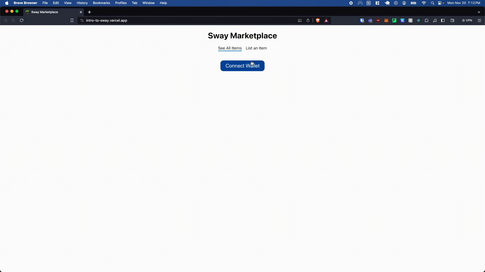

# 面向 JavaScript 开发人员的 Sway 语言简介

如果您熟悉 JavaScript 并对区块链基础知识有基本的了解，您可以快速掌握如何使用 Sway 在 Fuel 上构建全栈去中心化应用程序。一旦您掌握了 Sway 的基本知识，您就可以开始构建自己的 dapp。

在本教程 [仓库地址](https://github.com/fuelchina/sway-applications/tree/main/sway-marketplace) 中，我们将为类似于亚马逊的在线市场制定 Sway 合约，其中：

  1. 卖家可以列出产品。
  2. 买家可以购买这些产品。

智能合约最引人注目的特征之一是其不可更改性和无需许可性。这确保了任何单个实体在部署后都无法修改或调整市场规则。例如，一旦产品在合约中上市，部署者就不能突然改变其状态。同样，如果佣金金额被硬编码到合约中，则该金额将保持不变，从而防止对产品收取的佣金进行任何更改。

此外，合约对任何人开放。这种通用性允许任何个人使用其自定义前端参与市场，而无需获得许可。

在本教程中，我们将特别关注contract程序类型, 它是所有智能合约的基础。

## 什么是 Sway？
Sway 是一种基于 Rust 的强类型编程语言，专为在 Fuel 区块链上编写智能合约而设计。它利用了 Rust 的性能、控制和安全属性，使其适用于针对 gas 成本和合约安全性进行了优化的区块链虚拟机环境。

Sway 拥有强大的编译器和工具链。这些工具简化了复杂性，并确保您的代码高效、安全且性能最佳。

Sway 的真正与众不同之处在于其构建的卓越工具套件。这些工具经过精心设计，可将合约转换为全栈 dapp，确保无缝且无与伦比的开发人员体验。